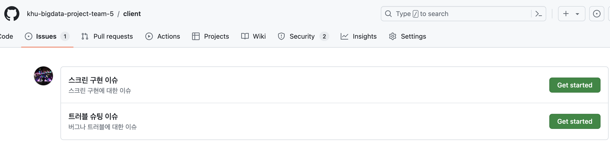
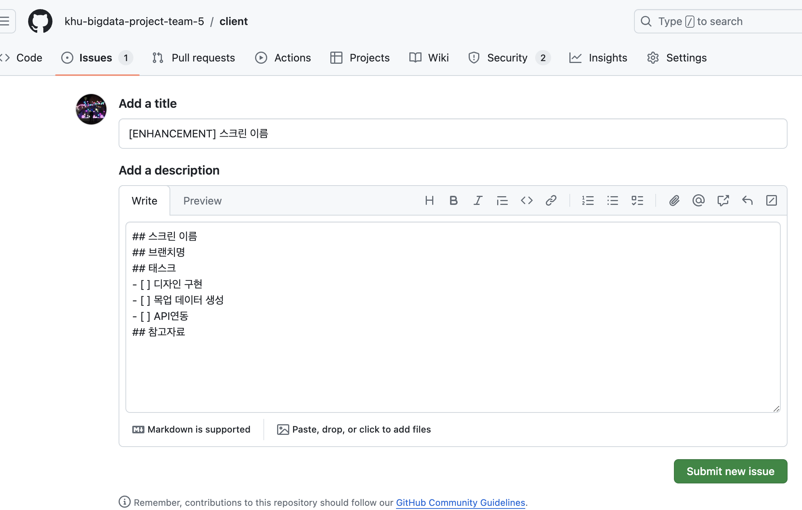

# INFoU Client

목차

- [Introduction](#Introduction)
- [Requirements](#Requirements)
- [Installation](#Installation)
- [Tools](#Tools)
- [Architecture](#Architecture)
- [Demo](#Demo)
- [Contribution](#Contribution)

## Introduction

해당 프로젝트는 [INFoU](https://github.com/philip-lee-khu/2024-BIGDATA-PROJECT-5)에서 제공하는 데이터를 기반으로 강의 추천 서비스를 제공하는 Client 프로젝트입니다.

주요기능은 다음과 같습니다.

- 강의의 키워드 찾기
- 강의의 키워드를 기반으로 다른 강의 추천
- 키워드별 강의 커리큘럼 생성
- 다른 유저의 커리큘럼 조회
- 강의의 강의력, 강의자료, 실습, 평점, 난이도와 강의평의 긍정/부정 분석 결과를 제공

## Requirements

- Node.js v20 이상
- npm v10 이상

Node.js와 npm에 대한 버전은 다음의 명령어로 확인할 수 있습니다.

```bash
$ node -v
v22.2.0

$ npm -v
10.7.0
```

## Installation

레포지토리 클론 및 의존성을 설치합니다.

```bash
$ git clone
$ npm install
```

백엔드 서버 주소 설정을 위해 `/src/services/apiService.js` 파일을 열어서 `baseURL`을 수정합니다.

```javascript
const baseUrl = /* 백엔드 서버 주소 */;

const apiService = {...};
```

## Tools

### React.js

React.js는 페이스북에서 개발한 UI 라이브러리로, 사용자 인터페이스를 만들기 위한 라이브러리입니다.

### Styled-components

Styled-components는 CSS-in-JS 라이브러리로, JavaScript 파일 내에서 CSS를 작성할 수 있습니다.

## Architecture

### `src/components`

컴포넌트들을 모아놓은 디렉토리입니다.

### `src/pages`

페이지들을 모아놓은 디렉토리입니다.

### `src/services`

백엔드 서버, 목업 데이터와 통신하기 위한 서비스들을 모아놓은 디렉토리입니다.

목적에 따라 `apiService.js`, `mockService.js`로 나뉘어져 있습니다.

### `src/api`

API 마다 정의된 엔드포인트를 모아놓은 디렉토리입니다.

### `src/hooks`

Custom Hooks Pattern을 사용하여, 컴포넌트 로직을 재사용하기 위한 디렉토리입니다.

`useFetch.js`는 데이터를 가져오는 로직을 재사용하기 위한 커스텀 훅입니다.

### `src/data`

enum, 상수, 모델 등을 모아놓은 디렉토리입니다.

### `src/mocks`

목업 데이터를 모아놓은 디렉토리입니다.

### `src/assets`

이미지, 아이콘 등의 정적 파일을 모아놓은 디렉토리입니다.

## Demo

### Page

프론트엔드의 데모 페이지는 [INFoU Web Site](http://infou-react-client.s3-website.ap-northeast-2.amazonaws.com/)에서 확인할 수 있습니다.

### Video

[](https://youtu.be/vlKwG_bhpgw)

## Contribution

### Pull Request

- 레포지토지를 포크합니다.

```bash
$ git fork https://github.com/khu-bigdata-project-team-5/client.git
```

- 포크한 레포지토리를 클론합니다.

```bash
$ git clone https://github.com/your-username/client.git
```

- 브랜치를 생성합니다.

```bash
$ git checkout -b feature/your-feature
```

- 변경사항을 커밋합니다.

```bash
$ git commit -m "Add your feature"
```

- 변경사항을 푸시합니다.

```bash
$ git push origin feature/your-feature
```

- Pull Request를 생성합니다.

### Issue & Bug Report

Issues 탭에서 새로운 이슈를 등록합니다.

추가 기능 구현에 대한 이슈는 스크린 구현 이슈로, 버그 제보나 트러블 슈팅에 관한 이슈는 트러블 슈팅 이슈로 생성합니다.



각 이슈 타입에 맞는 템플릿을 따라 작성합니다.

